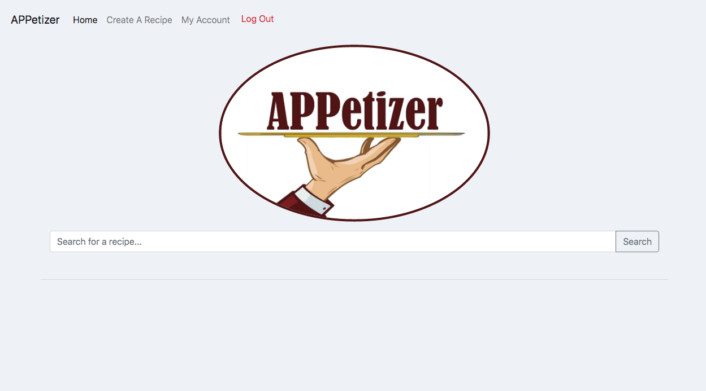
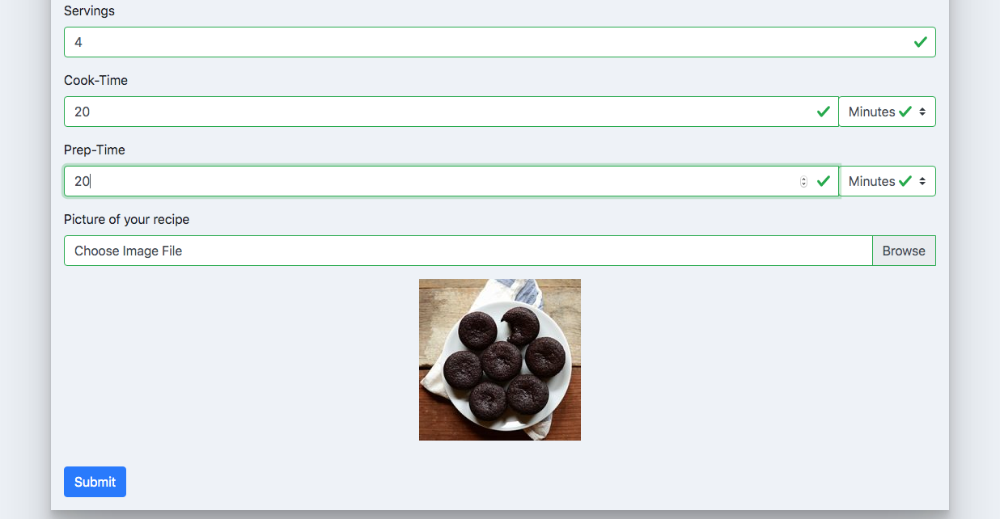

# Team Upsilon
## APPetizer
### Spring 2020

# Overview
`APPetizer` is a recipe application, focused on allowing users to find recipes to make using available ingredients. Users can search for recipes and limit searches by ingredients used. Users can signup to access the full functionality of our web application, including creating their own recipes, saving recipes to an account recipe book, keeping an inventory of pantry items, and adding items to a grocery list. We created this application with challenges of the current time in mind, hoping to encourage those staying at home to use up pantry items, and make the grocery shopping process more organized (by allowing shoppers to consult their grocery list and items in their pantry).

# Team Members
Sarah Young (syoung20)
Nicholas Kon (Nikon-knon)
Tinsae Erkailo (tinnytintin10)

# User Interface
## Homepage
The homepage is where users can search for recipes. At the top there is a navbar providing options including 'create a recipe', 'my acccount', 'login', and 'log out', based on whether the current user is logged in. 

Users can type in the search bar to search for a recipe, or they can further narrow their search by inputting the recipe type and ingredients to use. Multiple ingredients can be added to the search.

After searching, the results will populate in the lower part of the page. They give the user information including the title, the picture, the cook time, prep time, and servings. Clicking on one of these recipes will lead the user to the recipe page.

## Recipe
The recipe page is made up of the title, the image, the name of the creator, cook time, prep time, total time, servings, description, ingredients, and instructions. If the user is logged in they can add the ingredients to their grocery list or save the recipe to one of their recipe book categories. Users that are not logged in cannot do anything else on this page.

## Signup
The signup page allows users to register an account. They input their email, name, and a password.

## Login
The login page allows users to login using their email and password.

## Create Recipe
On the create recipe page, logged in users can add their own recipe to the web application. Users fill out inputs including title, description, recipe type, ingredients, instructions, servings, cook time, prep time, and image.

## Account - Recipe Book
The account page immediately loads with the recipe book view. In the recipe book, users can view the recipe book categories they have created, or add a new category. If they click on a category they get to the recipe category view.

## Account - Recipe Category
The recipe category view is a view on the account page. It allows the user to view the recipes saved to a specific recipe book category. On this view, users can also choose to delete the category, or they can click on a recipe and see options to either view the recipe or remove the recipe from their recipe book category. Clicking the left arrow will lead them back to the recipe book view.

## Account - Pantry
The pantry view is a view on the account page. It allows users to view pantry items. Users can add a pantry category, edit existing pantry categories (thereby changing the items in the category), or delete a pantry category.

## Account - Grocery List
The grocery list is a view on the account page, and is similar to the pantry except is intended to hold items the user wishes to buy, and can be added to from the recipe page. Categories can similarly be added, edited, and deleted.

# API
### /search/ [POST] [GET] 
A GET request to this url will serve the home page where the user can search for recipes.

Once the user searches for something, we will make a POST request to this endpoint with the parameters below in the body of the post request.

Parameters:
- search_query : search `string`
- params : an `object` that includes two lists:
    - recipe_categories: an `array of strings` of the recipe types selected
    - ingredients_list: an `array of strings` of the ingredients input

Response:
- A `json object` with the following:
  - recipes - an `array of json objects` (recipes) - each includes a title (`string`), image (`string`), cook time (`string`), prep time (`string`), servings (`string`)
  - filters - a `boolean` indicating if there are filters
  - filterMatchIng - a `boolean` indicating if ingredient filter matches any recipes
  - filterMatchCat - a `boolean` indicating if category filter matches any recipes
  - recipe_count - a `number` count of the number of recipes present in the field above. 
### /account/create [POST]
Create a user account.

Parameters:
- email : email `string` to serve as unique user identifier
- fname : first name a `string`
- lname: last name a `string`
- pswd: password a `string`

Response:
- page redirect to homepage if successful
### /account/check [POST]
Login to a user account

Parameters:
- email: email a `string`
- pswd: password a `string`

Response:
- page redirects to login page with status as url parameter
### /recipes/ [GET]
Serves the recipe page
### /recipes/add [POST]
Add a recipe

Parameters: 
- recipe.title: title of the recipe a `string`
- recipe.description: description of recipe a `string`
- recipe.category: category of the recipe a `string`
- ingredients: `array of strings`, ingredients in recipe
- quantity: `array of strings`, quantities of ingredients in recipe
- instruction: `array of strings` instructions in recipe
- cook.time: cook time a `number`
- cook.unit: unit of time a `string`
- prep.time: prep time a `number`
- prep.unit: unit of time a `string`
- servings: number of servings a `number`
- imageBG4: the image for the recipe as a base64 encoded data URL `string`

Response:
- page redirect to homepage
### /recipes/read [POST]
Read the data of a recipe from the database

Parameters:
- rid : recipe ID of recipe to read a `number`

Response:

JSON object that includes
- Recipe title (recTitle) a `string`
- Image (recImage) a `string`
- Description (recDescription) a `string` 
- Cook time (recCook) a `string`
- Prep time (recPrep) a `string`
- Servings (recServings) a `string`
### /recipes/instructions [POST]
Returns the instructions for a given recipe

Parameters:
- rid: recipe Id, a `string`

Response:
- instructions: an `array of strings`, instructions for the recipe
### /recipes/ingredients [POST]
Returns the ingredients for a given recipe

Parameters:
- rid: recipe Id, a `string`

Response:
- ingredients: an `array of strings`, ingredients for the recipe
- quantities: an `array of strings`, quantities for the ingredients
### /recipes/del [POST]
Delete an existing recipe.

Parameters:
- rid : recipe Id, a `string`

Response:

JSON object that includes
- Deletion Status message
### /recipes/addgroceries[POST]
Adding ingredients from recipe to a users grocery list
Parameters:
- grocery items : `array of strings`, ingredients to add

Response:
JSON object that includes
- Addition Status message 
### /recipes/saverecipe [POST]
Add recipe to a recipe book category

Parameters:
- catId : recipe book category id to add recipe to, a `number`
- rid : recipe Id of ingredient to add, a `number`

Response:

JSON object that includes
- Status message 
### /users/read
View user account.

Parameters:
- userId: unique email of user `string`

Response:
- userId : `string`
- name : name of user, `string`
- categories: an `array of objects`, recipe book categories, which are objects made up of category id (`number`), category title (`string`), and category image (`string`)
### /users/pantry/read
Read the pantry data.

Parameters:
- userId: unique email `string` of the user

Response:
- userId: userId `string` from request
- categories: an `array of objects`, pantry categories, where each category is an object made up of an id `number`, a title `string`, and an `array of strings` - food items

### /users/pantry/cat/add
Add a category to the pantry.

Parameters:
- userId: unique username `string`
- category: name of category `string`

Response:
- userId: userId `string` from request
- categoryId: the unique category id `number`
- category: `string` name of category from request

### /users/pantry/cat/del
Delete a category.

Parameters:
- userId: unique username `string`
- categoryId: the category id `number`
Response:
- userId: `string` userId from request
- categoryId: `number` categoryId from request

### /users/pantry/cat/edit
Edit a category. Updates the title and list of ingredients

Parameters:
- userId: unique username `string`
- categoryId: the category id `number`
- title: `string` name of category
- ingredients: `Array of strings` as of ingredient

Response:
- userId: userId `string` from request
- categoryId: the category id `number` from request
- title: the `string` title from request
- ingredients: the `list of strings` for ingredients from request

### /users/grocery/read
Read the grocery list data

Parameters:
- userId: unique username of the user `string`

Response:
- userId: userId from request `string`
- categories: an `Array of objects`, grocery categories, where each category is an object made up of an id `number`, a title `string`, and a list of food items (`Array of strings`).

### /users/grocery/cat/add
Add a category to the grocery list.

Parameters:
- userId: unique username `string`
- category: name of category `string`

Response:
- userId: userId `string` from request
- categoryId: the unique category id `number`
- category: `string` name of category from request

### /users/grocery/cat/del
Delete a category.

Parameters:
- userId: unique username `string`
- categoryId: the category id `number`
Response:
- userId: `string` userId from request
- categoryId: `number` categoryId from request

### /users/grocery/cat/edit
Edit a category. Compares the title and list of ingredients to any existing values, updating the values.

Parameters:
- userId: unique username `string`
- categoryId: the category id `number`
- title: `string` name of category
- ingredients: `Array of strings` as of ingredient

Response:
- userId: userId `string` from request
- categoryId: the category id `number` from request
- title: the `string` title from request
- ingredients: the `list of strings` for ingredients from request

### /users/recipebook/read
Read the recipe book data

Parameters:
- userId: unique username `string`of the user

Response:
- userId: userId `string` from request
- categories: an `Array of objects`, recipe book categories, which are objects made up of category id `number`, category title `string`, and category image `string`

### /users/recipebook/cat/add
Add a category to the recipe book.

Parameters:
- userId: unique username `string`
- category: name of category `string`

Response:
- userId: userId `string` from request
- categoryId: the unique category id `number`
- category: `string` name of category from request

### /users/recipebook/cat/del
Delete a category.

Parameters:
- userId: unique username `string`
- categoryId: the category id `number`
Response:
- userId: `string` userId from request
- categoryId: `number` categoryId from request

### /users/recipebook/cat/read
View recipes in a category.

Parameters:
- userId: unique username `string` of the user
- categoryId: `number` id of category

Response:
- userId: userId `string` from request
- categoryId: category id `number` from request
- title: `string` title of the category
- recipes: an `Array of objects`, recipes, where each recipe is an object made up of an id (`number`), a title (`string`), and an image url (`string`)

### /users/recipebook/cat/edit
Delete a recipe from a category.

Parameters:
- userId: unique `string` username of the user
- categoryId: the category id `number`
- recipeId: the recipe id `number` of recipe to delete

Response:
- userId: `string` user id from request
- categoryId: category id `number` from request
- recipeId: recipe id `number` from request

# Database

We are using PostgreSQL for our database. The database is made up of the following tables: recipes, ingredients, instructions, users, recipebook_categories, recipebook_category_items, pantry_categories, pantry_category_items, grocerylist_categories, and grocerylist_category_items. The columns and datatypes for each are displayed below, with a few edits*.

[Database Schema](mockups/appetizers_schema.pdf)

*Edits: we are not using the tags table. The recipes table also has a column named description, which is of datatype TEXT. The image column of recipes is also of type TEXT. In addition, all of the table id's (the primary keys) that are listed as type INT in the diagram are actually of type SERIAL in the Postgres database.

# URL Routes/Mapping

### /.  - Home Page
  - The page that loads up when I user enters to the website. In here users can search recipes, using different filters, clicking on any of the results wouldroute to the Recipe Page. In addition User can use the dashboard to Login (if not logged in). If they are they can acces the Create A Recipe page and My Account pages, in addition to logging out.

### /recipe  - Recipe Page
  - In this page users can view a particular recipe, on which they clicked either from the search in the home page, or their recipe book on the Account page
  + For this page you need to be redirected by clickin on a recipe in either account or home. If accessed without routing the page will load an empty recipe template.

### /login  - Login Page
  - User can log into their exiting accounts.

### /signup  - Signup Page
  - User can create a new account in the APPetizer website.

### /account  - Account Page
  - In their personal account page, users can see the recipes in their Recipe Book, their items in their Pantry, and their items/ingredients in their grocery list. All of which can be divided into different customizable categories. 
  + If not logged in (and accessed directly through the url) this page will redirect to the home page.

### /create_recipe  - Create Recipe Page
  - In this page users, if logged in, can create a new recipe to be added to the APPetizer database, that will be available to be viewed by any users. 
  + If not logged in (and accessed directly through the url) this page will redirect to the home page.

# Authentication/Authorization

  - We didn't really implemented any actual secured authentication. For the sake of the the functionality of our app however, login and signup are handled by endpoints and database functions. Login status throughout the use of the website is handled with the window localStorage Property. A user needs to be signed in to access the create a recipe and my account features of the website. The last one also including being able to add recipes and ingredients to the my account recipe book and groceries list, respectively, from directly from the recipe page.

# Division of Labor

Tinsae worked on the home page and create a recipe front end. He also worked on the /search and /recipe endpoints to implement searching and the process of adding a recipe to our database.  

# Conclusion

This was overall a fun but challenging project through which we have all grown in our web development skills. While working on this project, the value and sheer importance of planning was made immensely clear to us. When we failed to plan effectively, we often failed at what we were attempting to do and or were not very efficient in dealing with the problems we were running into. This is a valuable lesson we can all carry into our future careers. There wasn't one major difficulty we had; we happened to have little problems that came about because we initially didn't know how to use the resources available to us. 

Before starting this project, the importance of reading the documentation of tools we might use before attempting to use it would have been a useful thing. Overall this was a positive experience, thank you for guiding us through it (instructors)