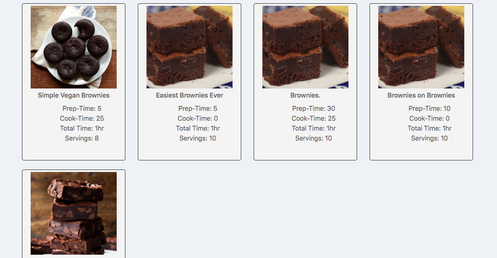
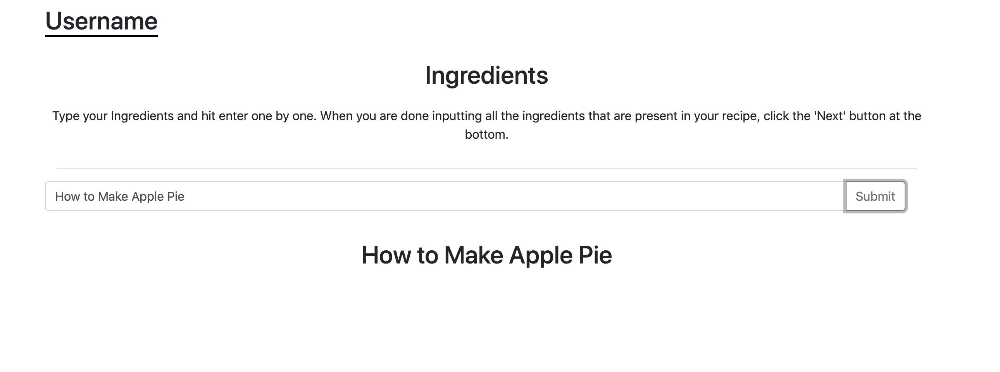

# Team Name 
Upsilon
# Web Application Name 
APPetizer
# Team Overview
1. Tinsae Erkailo 
2. Nicholas Koń 
3. Sarah Young 

# Data Interactions
At large, our important data includes users, recipe collections, recipes, comments, pantry lists, and grocery lists. Each of these is outlined below.
## Users
A user is created when a user of the application creates an account. The data attatched to a user at its initail creation will includes a unique username, a password, a name (will be used on account page, any comments created by the user, and any recipes created by the user), a pantry list, and a grocery list. Each of these will have a 1-1 relationship with user.
Each user can also create any number of recipes, comments, and recipe collections, all of which they should be able to edit.
## Recipe collections
The data of a recipe collection consists of a title, a user, and a list of recipes. The user is the creator of the recipe collection, and is the only one who can view or edit the collection. Recipe collections have no recipes when they are created, and recipes are added to the recipe collection by the user who owns it.
## Recipes
Recipes consist of many components: the user who created it, the title, an image, the name of the user who created it, basic details about the recipe (cook time, prep time, total time, and number of servings), an ingredient list, a list of instructions, tags that relate to the recipe, and comments. A recipe is created by a user, and can be edited by that user alone, except that other users may add comments. The data specific to the recipe is provided when the user creates a recipe. Other non-creator users can also add items from the ingredient list to their own grocery list, but may not edit the ingredient list.
## Comments
The data for comments is composed of the message of the comment, the user who created the comment, and the recipe that the comment is attatched to. Any user may create a comment on any recipe. Others cannot edit the comment.
## Pantry List
The pantry list contains two types of data: the user who it belongs to, and a lists of ingredients. The pantry list will be created upon creation of the user (there is always one pantry list per one user), although there will be no lists of ingredients to begin with. Users can add ingredients lists, and these lists can also be deleted or edited. Ingridients are added to a category by editing. A user's pantry list may not be accessed by other users. Eventually, we would like to be able to use the data in a user's pantry list to decide which recipes to recommend to the user in a recipe search.
## Grocery List
The grocery list is almost identical to the pantry list, except for in two details: the grocery list will not be used in recipe searches, and ingredients can be added to the grocery list from a recipe page. Otherwise, data for grocery lists is similarly made up of the user and lists of ingredients, and lists of ingredients can be added, edited, and deleted in the same fashion.

# Wireframes

## Wireframe for a recipe page

## Wireframes for account page

The grocery list tab on the account page will be the same as the pantry tab, with only the data differing.

## Wireframe for login page

## Wireframe for signup page

## Wireframe for results page

## Wireframe for recipe creation page (multiple for different stages of receipe creation)

The order of pages and the pages themselves might change, but this is the format of creating a recipe we want to follow.

## Wireframe for the Home Page

# Mockups

## Mockups for recipe page
Below are the recipe header and recipe details. The contents of the second picture, ingredients and instructions, are directly underneath the contents of the first. Below all of these are the tags and comment sections.

## Mockups for account page
These are both the recipe-book and pantry tabs of the account page. It is a one page HTML document, but the display will change in order to show contents of different tabs. The grocery list will look like the pantry tab.

## Mockup for login page

## Mockup for signup page

## Mockup for results page

## Mockup for recipe creation page

Basic form validation - making sure there is content in the input bar

## Mockup for the Home Page

# Divison of Labor
We divided labor by pages. Sarah worked on the recipe and account pages (`recipe.html`, `recipe.css`, `account.html`, `account.css`). Tinsae worked on the home page and recipe creation pages (`index.html`, `style.css`, `create_recipe.html`, `create_r.css`, `create_recipe.js`). Nick worked on the login, signup and result pages (`login.html`, `signup.html`, `login.css`, `results.html`, `results.css`).